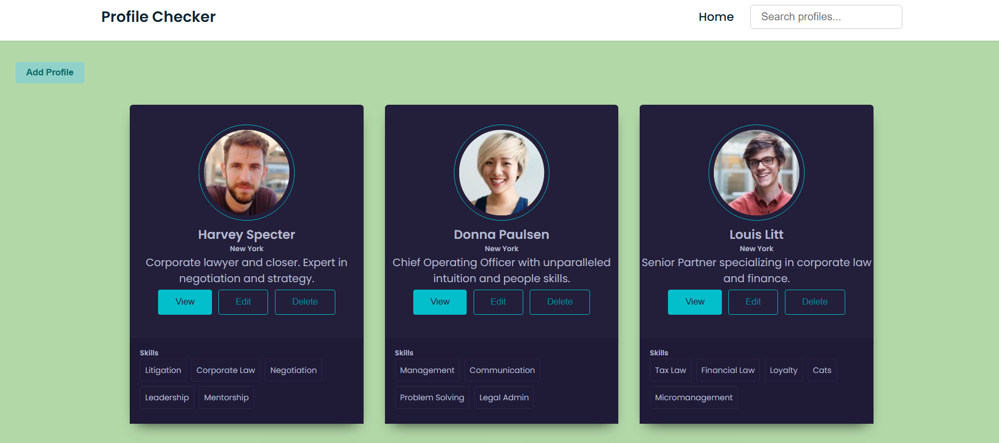
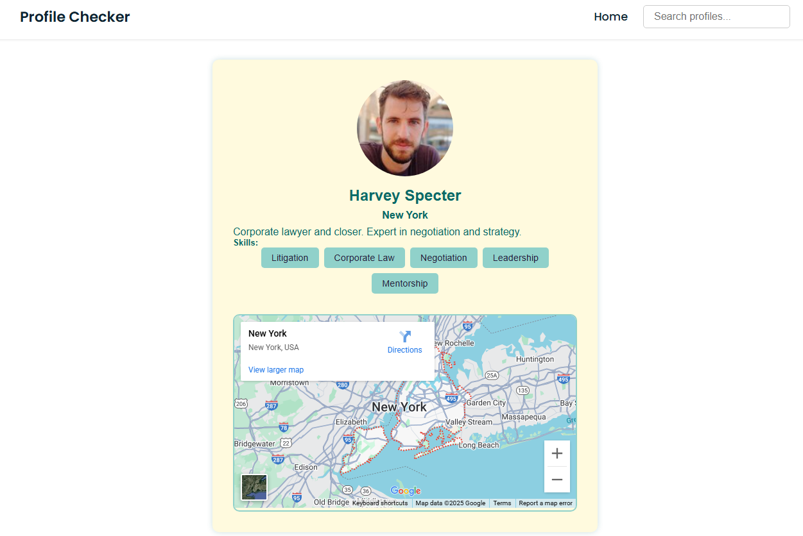

# 🌍 Profile checker

A modern web application built with **React** to browse, manage, and explore user profiles on a map. The app provides a clean UI to interact with profiles, visualize their locations, and manage data with full CRUD support.
Assignment -bynry Frontend case study
---

## 🔗 Live Demo

👉 [View the App on Vercel](https://bynryprofilepanel.vercel.app/)

---

## 📦 Project Overview

This project was built as part of a **Frontend Case Study**. It includes:

- Viewing user profiles in card format
- Real-time search and filtering
- Profile detail page
- Embedded map showing user's location
- Admin features: Add, Edit, Delete profiles

---

## 🎯 Features

### 👤 Profile Display
- Clean, responsive profile cards
- Shows name, image, description, location, and skills

### 🗺️ Interactive Mapping
- Integrated Google Maps view
- Location updates based on user edits
- “Summary” button shows map preview per profile

### 🔎 Search & Filter
- Real-time search by profile name

### 🛠️ Admin Panel
- Add new profiles
- Edit name, location, description, and skills
- Delete existing profiles

### 📱 Responsive UI
- Flexible grid and form layout

### ⚙️ Additional Enhancements
- Robust form validation
- Map iframe updates with user-edited address
- Componentized and reusable codebase

---

## 🧩 Tech Stack

| Tool / Library     | Purpose                        |
|--------------------|--------------------------------|
| React              | UI development                 |
| React Router       | Routing and navigation         |
| Google Maps (iframe) | Location visualization        |
| CSS (custom & Flexbox) | Styling and responsiveness   |
| Vercel             | Deployment (placeholder)       |

---

## 🗂️ Folder Structure

```bash
src/
├── components/
│   ├── Navbar.jsx
│   ├── ProfileList.jsx
│   ├── ProfileCard.jsx
│   ├── ProfileDetail.jsx
│   └── styles/
│       ├── ProfileCard.css
│       ├── ProfileList.css
│       └── ProfileDetail.css
├── data/
│   └── initialProfiles.js
├── App.jsx
├── index.js
└── App.css
````

---

## 📸 Screenshots



---

## 🧪 Getting Started

### 1. Clone the Repository

```bash
git clone https://github.com/akankshabhagat/bynryprofilepanel.git
cd profile-explorer
```

### 2. Install Dependencies

```bash
npm install
```

### 3. Run the App

```bash
npm start
```

The app will be live at: `http://localhost:3000`

---

## 🔐 Optional Enhancements

* Authentication for admin features
* Backend (Node.js/Express/Firebase) to persist profiles
* Mapbox integration with geocoding
* Loading spinners for map or network latency

---

## 🧾 Case Study Requirements Checklist

* ✅ Profile display with image, name, description
* ✅ Interactive map linked to each profile
* ✅ Map updates dynamically on edit
* ✅ Summary map preview per profile
* ✅ Full CRUD support (add, edit, delete)
* ✅ Admin dashboard functionality
* ✅ Real-time search and filter
* ✅ Profile detail view
* ✅ Responsive & mobile-friendly
* ✅ Error handling for invalid data

---

> Built with 💙 by Akanksha Bhagat
